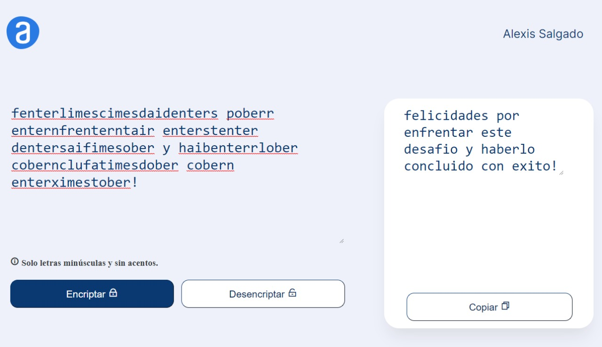
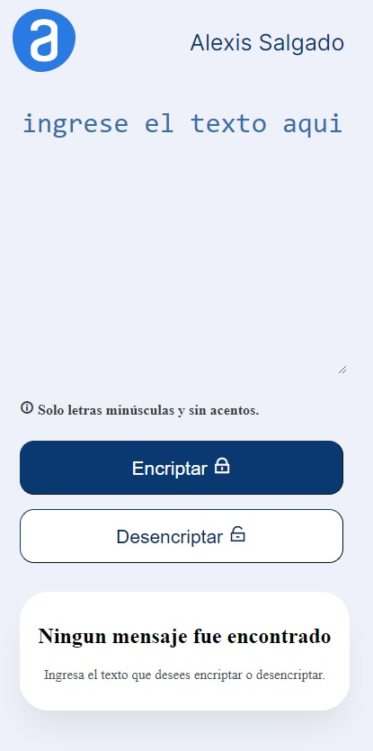

# Challenge ONE | Encriptador de texto
### Josue Alexis Salgado Romero | Grupo 4
---

## ¡Bienvenido a mi proyecto del Encriptador de texto!

#### Aquí encontrarás mi solución a este primer desafío.
---

  <h3>
    <a href="https://princesspoteto.github.io/challenge-one-encriptador-latam/">
      Live site
    </a>
  </h3>

---

## Resume del projecto

Este es el primer Challenge del programa ONE - Oracle Next Education. Esta aplicación tiene la función de codificar y decodificar mensajes de texto de forma sencilla. Con el objetivo de intercambiar información con otras personas de una manera segura y divertida.

## Llaves de encriptacion

- La letra **"e"** es convertida para **"enter"**
- La letra **"i"** es convertida para **"imes"**
- La letra **"a"** es convertida para **"ai"**
- La letra **"o"** es convertida para **"ober"**
- La letra **"u"** es convertida para **"ufat"**

**Aplica también a la inversa**

### Requisitos:

- Debe funcionar solo con letras minúsculas.
- No deben ser utilizados letras con acentos ni caracteres especiales.
- Debe ser posible convertir una palabra para la versión encriptada también devolver una palabra encriptada para su versión original.

` Por ejemplo: "gato" => "gaitober" "gaitober" => "gato"`

- La página debe tener campos para inserción del texto que será encriptado o desencriptado, y el usuario debe poder escoger entre as dos opciones.
- El resultado debe ser mostrado en la pantalla.

### Extras:

- Un botón que copie el texto encriptado/desencriptado para la sección de transferencia, o sea que tenga la misma funcionalidad del ctrl+C o de la opción "copiar" del menú de las aplicaciones.

---

<!-- Overview section -->

## Mensaje secreto

- Los desafíos de Alura lo ayudan a mejorar sus habilidades de codificación mediante la creación de proyectos realistas.

- Puedes ver un sitio en vivo en [challenge one encriptador](https://princesspoteto.github.io/challenge-one-encriptador-latam/)

### Vista de Version movile

### construido con

- HTML
- CSS
- Mobile-first workflow
- JavaScrip

<!-- Contact section -->

##  Contacto

- Github Repositories [@PrincessPoteto](https://github.com/PrincessPoteto)

---

    
Josue Alexis 2022

