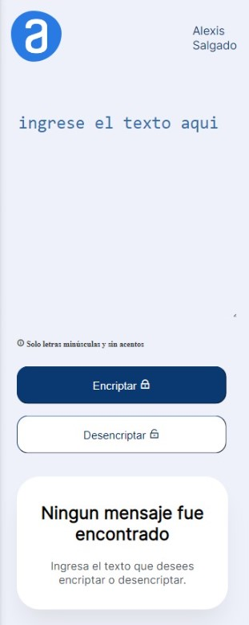

Challenge ONE | Encriptador de texto | Josue Alexis Salgado Romero | Grupo 4

     

### ¡Bienvenido a mi proyecto del Encriptador de texto!

#### Here you will find my solution to this first challenge

  <h3>
    <a href="https://princesspoteto.github.io/challenge-one-encriptador-latam/">
      Live site
    </a>
  </h3>

## Table of contents

- [Overview](#overview)
  - [Built with](#built-with)
- [Contact](#contact)

<!-- Overview section -->

## Overview

- Alura challenges help you improve your coding skills by building realistic projects.

- You can see a live site at [challenge one encriptador](https://princesspoteto.github.io/challenge-one-encriptador-latam/)

### Built with

- HTML
- CSS
- Mobile-first workflow
- JavaScrip

<!-- Contact section -->

##  Contact

- Github Repositories [@PrincessPoteto](https://github.com/PrincessPoteto)

---

    
Josue Alexis 2022

